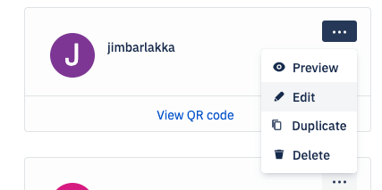

[Introduction](../index.md) / Device Template

# Device Template

Average reading time : {{ $page.readingTime.text.replace(' read', '') }}s

## How to use Esper's Device Template.

Device Template is a one stop means for you to quickly provision your device. It lets you create a profile for the device where you may choose the policy, apps, device settings, Device Group, and the wallpapers that you want to be provisioned on the device. Device Templates can be created, saved, and used to provision at a later point.

## Steps to create a Device Template.

1.  Click on 'Device Template'.
2.  Click on 'Create Template'.
3.  Enter a name for the Device Template. Click 'Next'.

### In the Policy section

Set default app permissions, Android setting app, system updates, password rules, and turn on the toggle buttons for the settings you wish to enable on your devices. If you wish to have Google Play Store show up on the device, you may turn on the toggle button. You may reset these values to default at any time by clicking 'Reset to Default'.

In order to restrict phone numbers that can make or receive calls to the device, upload a .csv file with the allowed phone numbers separated by commas. All numbers must be preceded by +country code (for example +1 for US):

Click 'Next'.

### In the Apps section

Select 'Kiosk mode' to pin an app during startup for devices that need to operate in Kiosk Mode. Or choose 'Multi application mode' to give users access to the Home screen inorder to be able to use multiple apps on the Esper managed device. 

[Kiosk-Multiapplication mode section](../../assets/OLD_DASHBOARD/kiosk-multiapplication-template.png)

Afer choosing the app mode, choose the apps that you would like to have installed on your device during provisioning. 

You may choose from install apps that are-
1. Preloaded apps - There are many preloaded apps packaged with android devices. Approve these apps to show up on your device after provisioning by adding their package name in the following section-

2. Private apps - These are your private or company apps (in-house apps) that can be uploaded on Esper Dashboard via [App Management](../app-management/index.md). After uploading, user may choose to install these apps during provisioning via template in the following section or install them post provisioning.

3. Google apps - You may install apps from Google Play Store that you approved via [Play For Work](../play-work/index.md) as shown below - 

Please note that only once you [Approve a Google Play Store App](how-approve-google-play-store-app/index.md), you may add it from the list shown in the Device Template.
:::

Click 'Next' to move to next section.

### In the Branding section

Upload landscape and/or portrait wallpaper.

There is an option to Preview the uploaded wallpapers:

Click 'Next'.

### In the Settings section

Choose the device settings you would like to have on your provisioned devices such as Bluetooth, Wi-Fi, volume, screen rotation, GPS, and screen timeout. Click 'Next':

### In the Group section

Select an existing Group or create a Group. The devices provisioned using this device profile will be a part of the selected Group. Click 'Next':

### On the Preview screen
 You will see a preview of the entire device template. If you wish to edit your settings, use the 'Back' button to go back to the appropriate screen:

Click 'Save'. You will see a pop-up to confirm your settings. Click 'Okay':

The Device Template you just created will now be visible on the Device Template page. You can search for it in the search bar. Click on it to view the Device Template. Click on 'View QR code' to provision a device using this template directly from your Device Template.

On clicking the View QR code, there is also an option to download the config.json file that can be used during ADB and IMEI provisioning:

  
You can also Preview, Edit, Duplicate & Delete the template:

Click on the ellipsis (...) on the template tile to preview, edit, duplicate or delete a template.

*   **Preview Template**

Click on the Preview option to preview the device template. Click on the + sign to expand and then check selected individual components.

*   **Edit Template**

To edit any template, click on the 'Edit Template' option. Policy, Apps, Branding, Settings, Group and Add devices options can be updated as required. To save the changes, click on the 'Update' button on the Preview page.

*   **Add Devices (IMEI Provisioning)**

While editing a template, you also have the option to add IMEI/Serial numbers of devices you want to provision with this template. There is a section 'Add devices' that appears if you click on Edit Template. Using this section, user can upload IMEI and Serial numbers. See details on IMEI Provisioning via Template [here](https://docs.esper.io/home/devconsole/device-template/imei-provisioning-template/).

*   **Delete Template**

Click on the 'Delete Template' option on top right to delete a selected template.

  

[Return to Introduction](../index.md)
