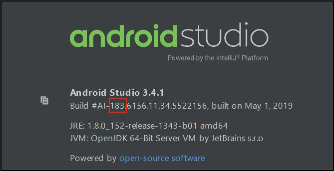
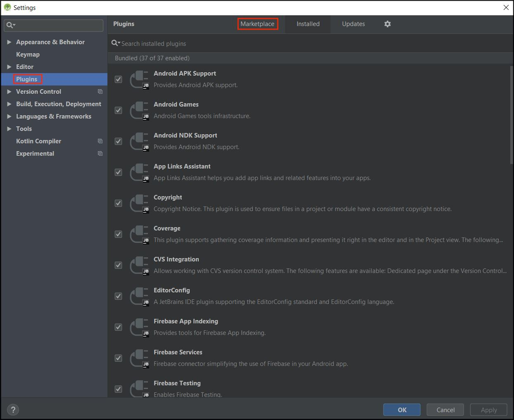
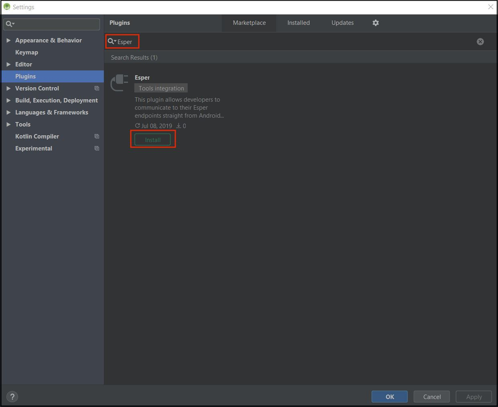
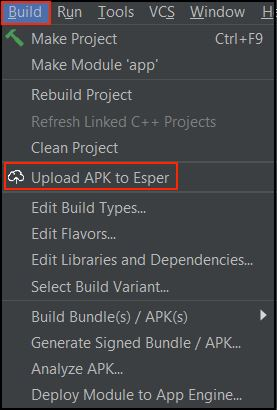
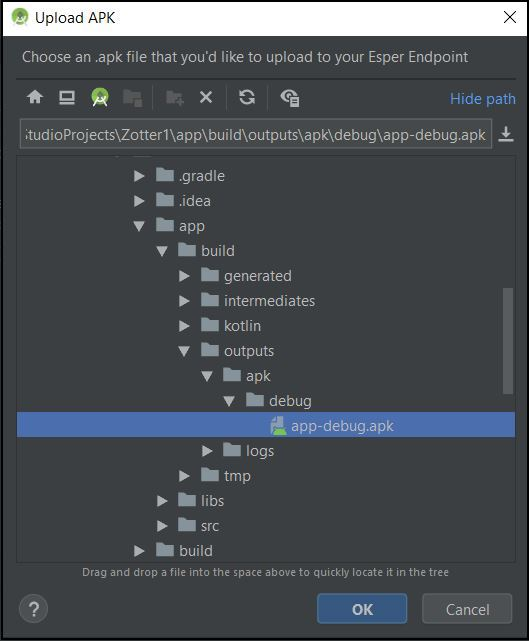
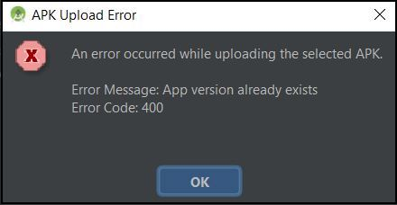
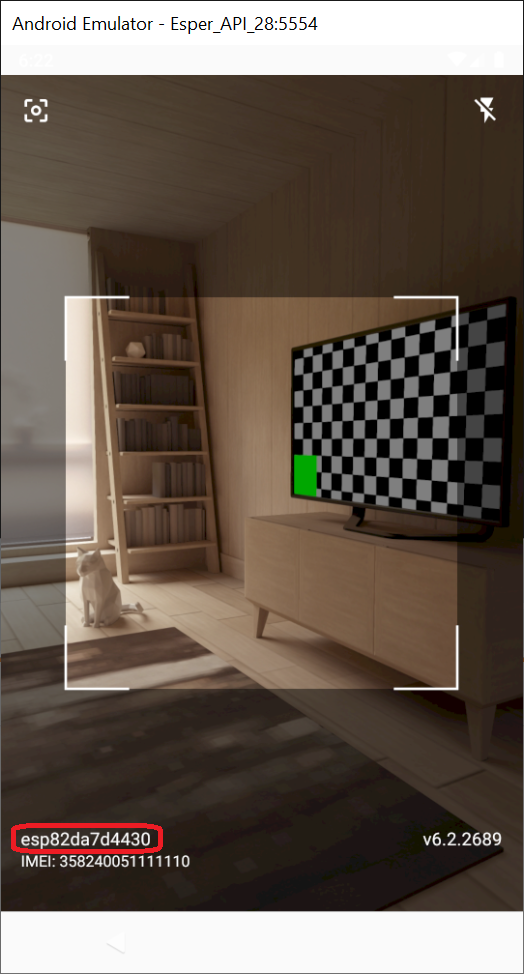
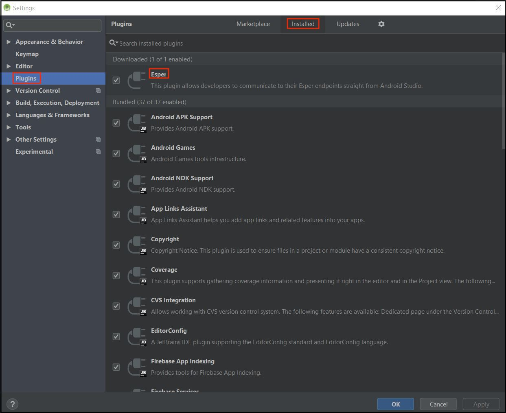
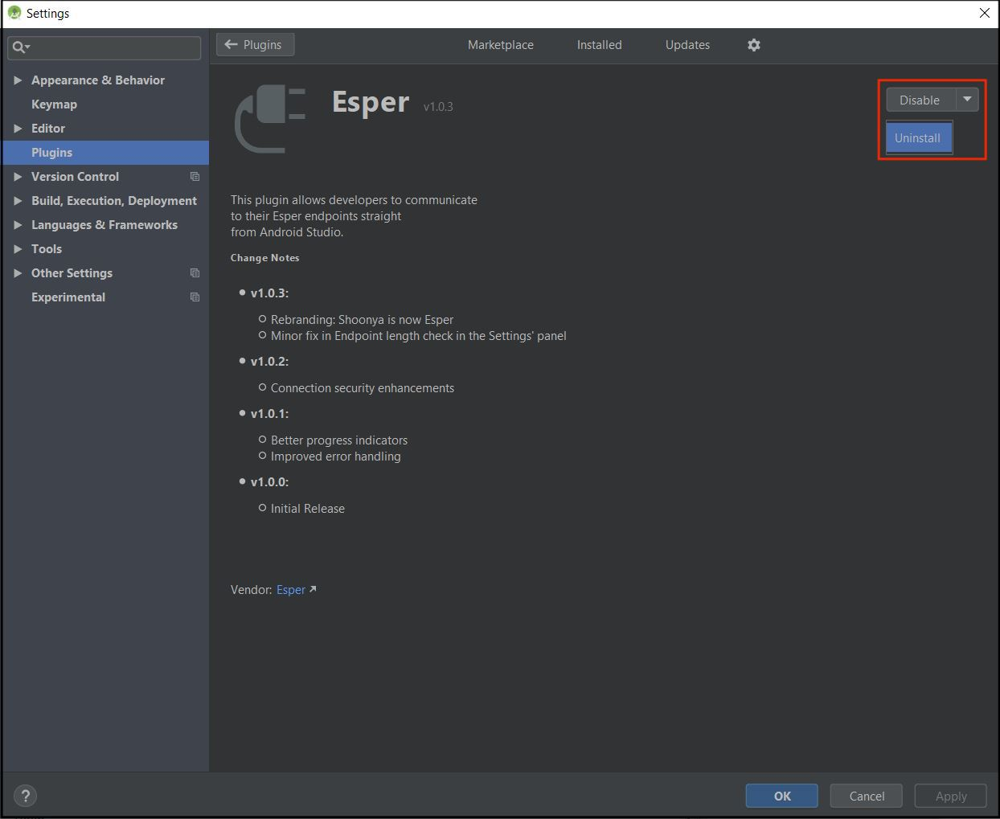

# Esper Android Studio Plugin <Badge text="Preview Release" type="tip"/>

Average reading time : {{ $page.readingTime.text.replace(' read', '') }}

Esper Plugin for Android Studio

The Esper Plugin for Android Studio enables developers to upload APKs directly from Android Studio to an Esper Endpoint. Once uploaded to Esper you can use the Esper APIs, SDK, or CLI from Android Studio Terminal to provision devices with the APK for testing or deployment purposes. Or you can go to the Esper Console and work with your APK from there.
This guide describes the steps to take to install the Esper Plugin into Android Studio.

## Requirements
Before you start with this guide, make sure you have Android Studio installed, version 181 or greater. 
To verify your Android Studio go to Help → About. The version number is circled below:

In case you have a version before 181, simply upgrade your Android Studio to the latest version. The latest available version can be installed by clicking on Help → Check for Updates and then following the subsequent prompts.
You will also need an account on an Esper Endpoint. Have your Endpoint name, username, and password available. If your company doesn’t have an Esper Endpoint, sign up for an Esper Trial account [here](https://esper.io/signup).

## Installation
Next, you will find the Esper Plugin from the Plugin Marketplace; go ahead and install it.
Go to File → Settings and then click on Plugins (or Android Studio → Preferences for Mac). Then click on Marketplace:

In the new window that displays, type Esper in the Search plugins in marketplace input field and hit Enter. Click on Install to start the installation process.

The Plugin will then download and install, and you’ll need to restart the IDE to activate the change to your Plugins.
If this is the first time you are installing a 3rd-party plugin, Android Studio will show you the following warning:

Click on Accept to proceed. If you have installed third-party plugins before, you will not see this prompt, and you can proceed to the next step.
Once Android Studio restarts, check the Event Log in the lower right corner to verify the Plugin successfully installed.

## Setup
The setup for the Esper Plugin is Project specific for the currently open Project. If you wish to use the Esper Plugin for other Projects, be sure to perform the setup for each. 
With your desired Project open, go to File → Settings (or Android Studio → Preferences for Mac). Click on the drop down for Other Settings, and the click on Esper from the resulting list. In the Esper window, type in the relevant credentials for your Endpoint Name, Username, and Password. Hit Apply and then OK.

The Plugin is now configured to your Endpoint for this Project.
 
 
## Uploading APK to Esper

Now once you are ready to upload an .apk file to your Endpoint, simply go to Build → Upload APK to Esper:

In the dialog that appears, choose the .apk to upload to your Endpoint, and then hit OK:

You’ll see a dialog box showing the status of the upload process. If the upload succeeds, you will see the following message:

If there's any error, you'll see an error as shown below:

Note that trying to upload the same version of the .apk you already have on your Endpoint will produce an error. You currently cannot overwrite it using the Plugin, you will have to delete it using the Esper Console or from the CLI.

 

## Deploying application to a group of devices
Esper plugin facilitates developers to deploy an uploaded application to a group.

### After uploading APK
After [uploading the APK to Esper](#uploading-apk-to-esper), developer can opt to deploy to a group of devices.

### Uploaded applications
Developers can choose an application and a group.\
\
\
\

Deployment status will be updated until the deployment is completed.

Deployment status can be monitored from the background as well (Click on Deploy in background button). Intermediate status will be updated at background progress bar.

Final status will be updated with a notification.

Final status can also be seen in event log as well.

 

## Esper Android Virtual Device
Esper AVD allows the users to experience the Esper Agent for Android Devices.

Virtual devices are a convenient means to target a device without having the available hardware, or when you do not want to risk breaking the actual hardware device. By trading off the lower performance of a virtual device, you gain a very capable and streamlined virtual device that can hugely boost your productivity during development and early testing.

The Esper Android Tools provide a customized Esper Virtual Device (EVD) image based on the x86 platform allowing you to try out Esper Enhanced Android providing features such as Zero-touch enrollment. You can register your EVD serial number or IMEI number using an Esper Device Template of your choice and then re-start the EVD. On boot the EVD will then get enrolled to your Endpoint automatically and you can start accessing the EVD and take actions using the Esper Console or through our APIs, SDK, and CLI.

### Usage Instructions
Inorder to get the Esper Virtual Device, simply follow the instructions -

1. Install & setup [Esper Android Studio Plugin](https://docs.esper.io/home/esperplugin.html#requirements)
2. Please download the AVD from the Android Studio Tools menu as intructed below.
Once done, you can simply launch the Esper AVD as you'd any other AVD.

When android studio is started, plugin notifies the user about newly avaiable AVDs or updates available for the installed AVDs.\
\
\
\
\
To create or update Esper AVDs, navigate to Tools Menu > Esper AVD Manager.\
\
\
\
\
Click on "Esper AVD Manager".\
\
\
\
\
Click on "Create" or "Update". User will be informed that AVD (Esper Virtual Device is also known as EVD) will be created in background.\
\
\
\
\
Click on "Ok" button. Esper AVD (EVD) creation happens in background.\
\
\
\
After the EVD is created, user will be prompted to restart Android Studio.\
\
\
\
\
Click on Restart. Android Studio will be restarted. After restarted, navigate to Esper Toos Menu > Esper AVD Manager. Esper AVD Manager shows that AVD is up-to-date.\
\
\
\
\
AVD can be launched from Android Studio like other AVDs.\
By clicking run app\
\
\
\
From AVD Manager\
\
\
\
Esper AVD (EVD) is up.\
\
\

When the EVD is launched, it will show up an emulated camera screen, as if to it's ready to scan a QR code. 

Inorder to provision the AVD (EVD) to your endpoint, you can grab the Serial number from the AVD (EVD) screen and add it to your template(used for provisioning).

To find out how to add Serial Number or IMEI number to a template for provisioning, refer to this page - 

[Adding IMEI/Serial Number to a Template](https://docs.esper.io/home/devconsole/device-template/imei-provisioning-template/)

If you'd rather use ADB to get the serial number, you can also use adb shell getprop ro.serialno  

Please reboot the Esper AVD (EVD) after that (or hit the "back button" once). Now your Espe AVD (EVD) will provision and start talking to the Esper endpoint automatically.

 

## Uninstalling

To uninstall the Esper Plugin Go to File → Settings (or Android Studio → Preferences for Mac), click on Plugins ensuring you are displaying Installed Plugins. Then click on the Esper bolded Plugin name:

This will bring up the Esper Plugin detail. Go over to the dropdown that is displaying Disable, Click the dropdown and then select Uninstall.

Confirm you wish to uninstall the Plugin by clicking on Yes:

Now click on the Restart IDE button:

Then click Restart to remove the Plugin:

That's it. The Esper Plugin should now be uninstalled.

