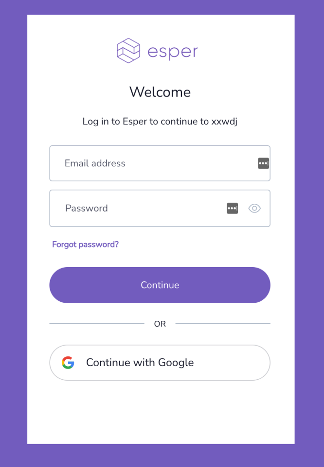

As Esper strives to provide our customers with the most advanced functionality for their devices, we're excited to announce that we'll be transitioning to Single Sign-On (SSO) with support for SAML and OIDC, enhanced security, and other features. This transition will begin in February 2022, and we will begin notifying users via email when they will need to reset their passwords in order to migrate to these new and exciting features.

Once this process starts, you will need to log in to the system again. 

If you log in to Esper using your **email address and password**, you’ll be prompted to log in using these same credentials. 
If you used your username to log in, you’ll now have to use an email address associated with your Esper account. 
If you have multiple Esper tenants, you may use the same email and password to log into them. 

If you use Sign In with Google, select the option to **Continue with Google**. You’ll receive directions to check your email for an invitation sent from Esper. Click on the invitation link to log in using Sign In with Google. The link will be valid for 24 hours.

**Frequently Asked Questions**

**Why do I need to do this?**

As part of the migration process, you’ll be required to reset your sign-on method. 

**What will change with the new authentication system?**

There will be two major changes: 
You may continue to use email/password *and* Sign In with Google to log into Esper. :::
::: warning 
Note: These methods will create different accounts in the Console’s User Management section. :::
You will no longer be asked to sign up with a username, first name, and last name. We’ve simplified this process so that now only a single name will be used in the Esper Console. 

**What if I’m already using SSO to sign in to Esper?**

You should receive an email with instructions on how to transition to the new SSO method . If you did not receive an email, and you use SSO to currently sign in to Esper, please reach out to [Esper Support](mailto:support@esper.io). 

**Should I set up SSO, and how do I do that?**

Not every organization will need SSO. However, if you already have an identity provider such as Okta, it may make sense to implement it in Esper. 