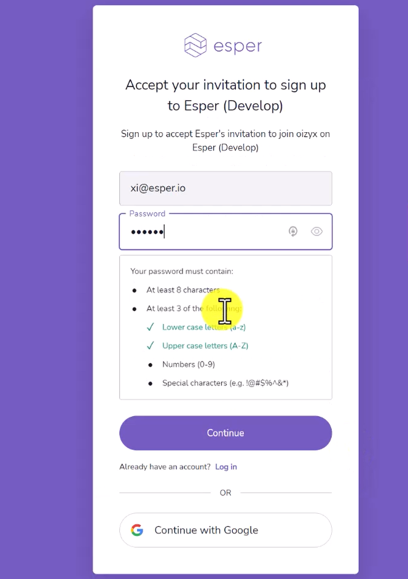

# Esper Single Sign-on (SSO)

As Esper strives to provide our customers with the most advanced functionality for their devices, we're excited to announce that we'll be transitioning to Single Sign-On (SSO), with enhanced security, support for SAML and OIDC, and other features. As part of this transition, starting in November 2022, we will begin notifying users, via email, when they will need to reset their passwords in order to migrate to these new and exciting features.

Once this process starts, you should receive an email with a sign-up link. 

Click on the link to sign on to the Esper console. The link is active for 7 days. 

**Step 1**
Look for an email sent by Esper. Click on the link in the email to get started.

**Step 2**
Choose a method: Email+Password or Google. Going forward, you will only be able to log in using that method.
If you choose email & password, you may use your previous password or set a new one. 

**Step 3**
Sign on to Esper as you normally would. 

We've also created a guide to describe this process:  

<iframe src="https://scribehow.com/embed/How_to_Migrate_your_Esper_Account_to_our_New_SSO_Platform__SNEwGMcZTVajjxgEi5HoUw" width="640" height="640" allowfullscreen frameborder="0"></iframe>

**Why do I need to do this?**

As part of the migration process, you’ll be required to reset your sign-on method. 

**How long is the invitation period?**

The invitation link is active for 7 days after it is sent. After those 7 days, another email will be sent out with a different link that will also be active for 7 days. 

**What happens if I don’t accept the invitation or if I let the invitation expire?**

If you don’t accept the invitation, administrators have the ability to send new invitation links (valid for 24 hours). However, if all users in your tenant miss the invitation period, they’ll need to reach out to [Esper Support](mailto:support@esper.io). 

**What will change with the new authentication system?**

There will be two major changes: 
If you used both the email/password *and* Google Sign-on to log into Esper, this will no longer be possible. You will need to choose one method.
You will no longer be asked to sign up with a username, first name, and last name. We’ve simplified this process so that now only a single name will be used in the console. 

**What if I’m already using SSO to sign in to Esper?**

You should receive an email with instructions on how to transition to the new SSO method . If you did not receive an email, and you use SSO to currently sign in to Esper, please reach out to [Esper Support](mailto:support@esper.io). 

**Should I set up SSO and how do I do that?**

Not every organization will need SSO. However, if you already have an identity provider such as Okta, it may make sense to implement it in Esper. [See how to implement SSO in our console docs](https://console-docs-v2.esper.io/sso/).

